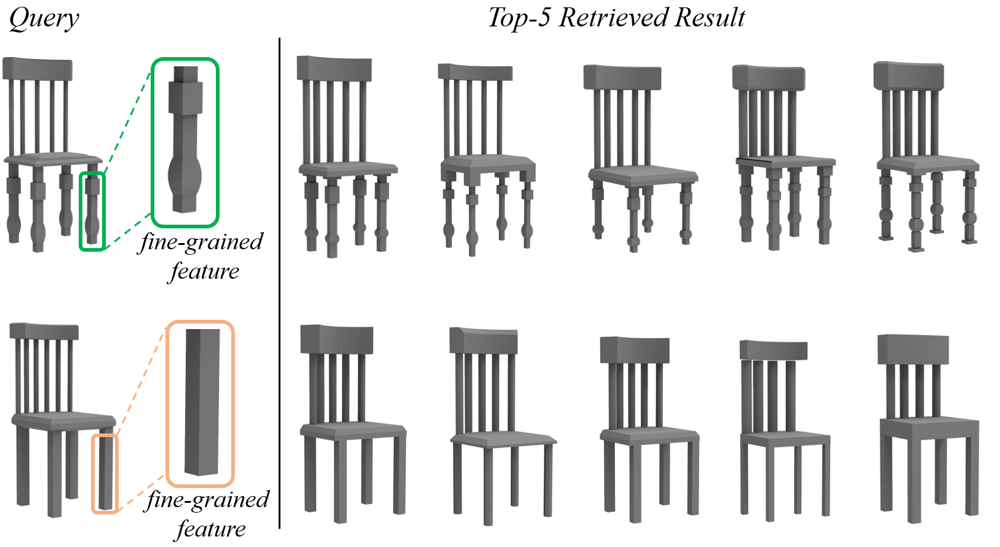
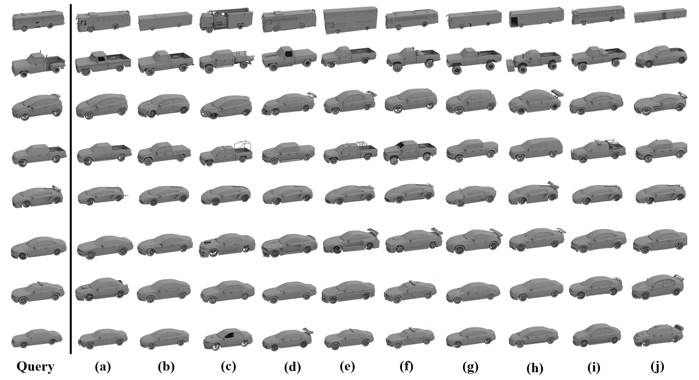
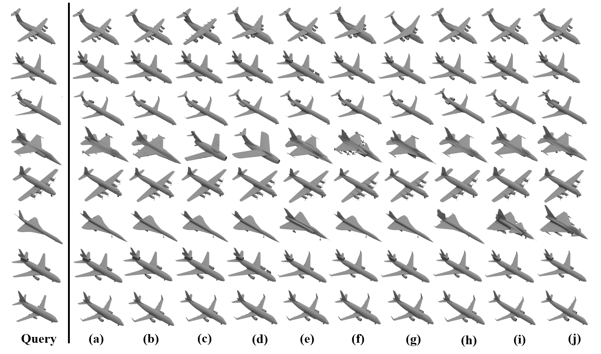

# RISA-Net: Rotation-Invariant and Structure-Aware Network for Fine-grained 3D Shape Retrieval
Rao FU, Jie Yang, Jiawei Sun, Fanglue Zhang, Yu-Kun Lai and Lin Gao.
[Project Page](https://github.com/IGLICT/RisaNET/)



### 1) Fine-grained 3D shape retrieval dataset
Please [download](https://drive.google.com/drive/folders/1BpwtlhrYfR5xGcXGoYFjo9bQFtw4nFvP?usp=sharing) our fine-grained 3D shape retrieval dataset. The dataset provides a quantatitive measure for fine-grained 3D shape retrievals. It contains 6 object categories: knife, guitar, car, plane, chair and table, each of which is further divided into dozens of categories. 
We provide 5 versions of the datset: 
1. unregistered integerated aligned model,
2. unregistered integerated perturbed model, 
3. unregistered segmented aligned model, 
4. unregistered segmented perturbed model, 
5. regitered segmented aligned model.


### 2) Training
We provide code to train the RISA-Net.

#### a) Preprocessing
We first need to extract the base geometric feature: edge length and diheral angles from the registed segmented shapes. We also need to analyse structure information and make a lable file for triplet loss training. All preprocessing codes are placed in the [matlab]() file. Please install [Matlab](https://www.mathworks.com/products/matlab.html) before running the code.

* To extract base geometric feature, please run: [get_edge_feature_all.m](./matlab/get_edge_feature_all.m).
* To analyse structure information, please run: [pca_of_each_part.m](./matlab/pca_of_each_part.m).
* To make label file for triplet loss, please run: [gmake_label_for_trip.m](./matlab/gmake_label_for_trip.m).

#### b) Learning
Our network is based on [Tensorflow](https://www.tensorflow.org/). First, you need to set up an environment. Please run:
```
cd python;
pip install -r requirements.txt
```

After the environment is set up, you can train our network. Please run:
```
python risanet.py -a 1e3 -b 1e2 -c 1e0 -d 1e3 -e 1e2 -f 5000 -x 0.3 -y 0.3 -s 32 -m 32 -n 32
```

After the network is trained, you can load the shape descriptors for shape retrieval. Please run:
```
python risanet.py -r /path/to/checkpoint -k 5000
```

### 3) Demos

Here we provide some retrieval results on several datasets.


